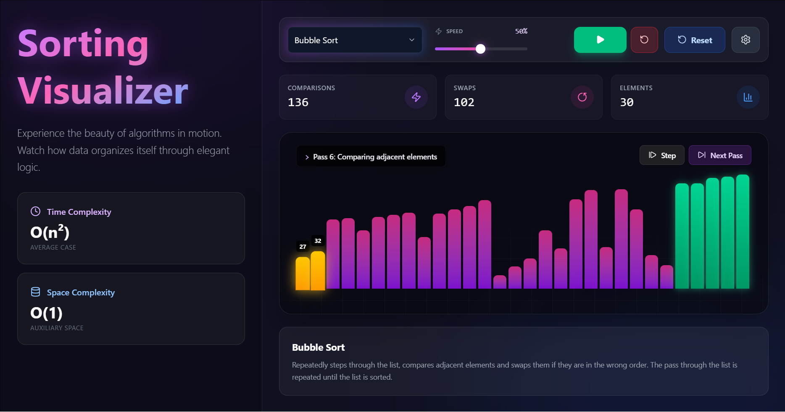

# Sorting Visualizer 

> *Experience the beauty of algorithms in motion.*

A breathtaking, modern web application designed to visualize how classic sorting algorithms work. Built with **React** and **TailwindCSS**, this project features a premium "glassmorphism" aesthetic, fluid animations, and a fully responsive design that works seamlessly on both desktop and mobile devices.

 

## 🌟 Features

- **8+ Sorting Algorithms**: Visualize the mechanics of Bubble, Selection, Insertion, Merge, Quick, Heap, Shell, and Radix Sort.
- **Hypnotic Visuals**:
  - **Glassmorphism UI**: Frosted glass effects with deep background gradients.
  - **Neon Glows**: Dynamic lighting effects on sorting bars using custom CSS.
  - **Smooth Animations**: Fluid transitions for swapping and moving elements.
- **Interactive Controls**:
  - ⏯️ **Play/Pause**: Halt execution at any moment to inspect the state.
  - ⏩ **Speed Control**: Fine-tune the sorting speed with a custom premium slider.
  - 🔡 **Custom Input**: Test the algorithms with your own specific set of numbers.
  - 🎲 **Smart Randomization**: Automatically generates an array size optimized for your screen (less clutter on mobile!).
- **Real-time Statistics**: Watch comparisons and swap counts update live as the algorithm processes.
- **Fully Responsive**:
  - **Desktop**: Features a collapsible sidebar for maximum viewing area.
  - **Mobile**: Intuitive drawer/overlay navigation for small screens.

## 🛠️ Tech Stack

- **Core**: [React.js](https://reactjs.org/) (Hooks, Functional Components)
- **Build Tool**: [Vite](https://vitejs.dev/) (Blazing fast local dev)
- **Styling**: [TailwindCSS](https://tailwindcss.com/) (Utility-first + Custom Config)
- **Icons**: [Lucide React](https://lucide.dev/)
- **Architecture**: Modular algorithm design (Separation of concerns).

## 🚀 Getting Started

Follow these steps to run the visualizer locally on your machine.

### Prerequisites
- Node.js (v14 or higher)
- npm or yarn

### Installation

1. **Clone the repository**
   ```bash
   git clone https://github.com/atharvabaodhankar/Sorting-Visualizer.git
   cd Sorting-Visualizer
   ```

2. **Install Dependencies**
   ```bash
   npm install
   ```

3. **Run Development Server**
   ```bash
   npm run dev
   ```

4. **Open Browser**
   Navigate to `http://localhost:5173` to see the app in action!

## 🧠 Supported Algorithms

| Algorithm | Time Complexity (Avg) | Space Complexity | Best For... |
|-----------|----------------------|------------------|-------------|
| **Bubble Sort** | $O(n^2)$ | $O(1)$ | Educational purposes, small datasets. |
| **Selection Sort** | $O(n^2)$ | $O(1)$ | Simple implementation, minimizing writes. |
| **Insertion Sort** | $O(n^2)$ | $O(1)$ | Small or nearly sorted datasets. |
| **Merge Sort** | $O(n \log n)$ | $O(n)$ | Stable sorting, large datasets (Linked Lists). |
| **Quick Sort** | $O(n \log n)$ | $O(\log n)$ | General purpose, high performance. |
| **Heap Sort** | $O(n \log n)$ | $O(1)$ | Systems with limited memory. |
| **Shell Sort** | $O(n \log n)$ | $O(1)$ | Optimizing insertion sort for medium datasets. |
| **Radix Sort** | $O(nk)$ | $O(n+k)$ | Integers/Strings, massive datasets. |

## 📂 Project Structure

```bash
src/
├── algorithms/       # Individual logic for each sorting algorithm
│   ├── bubbleSort.js
│   ├── mergeSort.js
│   └── ...
├── App.jsx           # Main entry point
├── SortingVisualizer.jsx # Core visualization component & UI logic
├── index.css         # Global styles & Tailwind directives
└── main.jsx          # React DOM rendering
```

## 🤝 Contributing

Contributions are welcome! If you have an idea for a new algorithm or a UI improvement:
1. Fork the project.
2. Create your feature branch (`git checkout -b feature/AmazingFeature`).
3. Commit your changes (`git commit -m 'Add some AmazingFeature'`).
4. Push to the branch (`git push origin feature/AmazingFeature`).
5. Open a Pull Request.

---

Made with ❤️ by [Atharva Baodhankar](https://github.com/atharvabaodhankar)
